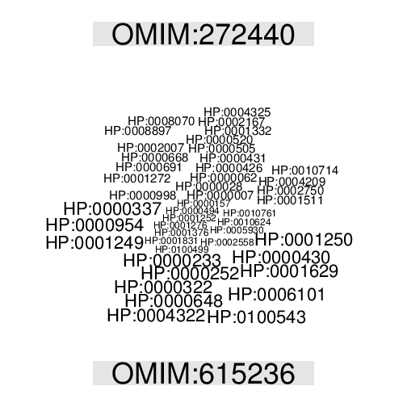
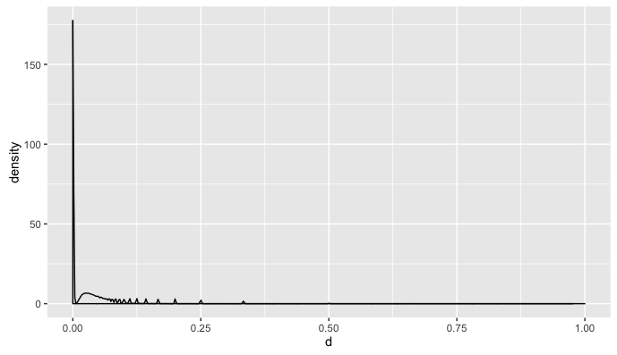

Clustering OMIM diseases
========================

There are about 8,000 or so described rare diseases. Many of them have overlapping clinical features. Here I try to cluster all the OMIM diseases based on the number of overlapping features.

# How many OMIM IDs with HPO terms?

~~~~{.bash}
gunzip -c ../script/phenotype_annotation.tab.gz |
awk '$1 == "OMIM" {print}' |
cut -f2 | sort -u | wc -l
    6947
~~~~

# How many terms are associated with each OMIM ID, on average?

~~~~{.bash}
gunzip -c ../script/phenotype_annotation.tab.gz |
awk '$1 == "OMIM" {print $2}' |
sort | uniq -c | awk '{print $1}' | stats
Total lines:            6947
Sum of lines:           103841
Ari. Mean:              14.9476032819922
Geo. Mean:              8.64515221919539
Median:                 9
Mode:                   2 (N=809)
Anti-Mode:              83 (N=1)
Minimum:                1
Maximum:                249
Variance:               313.762620929126
StdDev:                 17.7133458423056
~~~~

On average, each OMIM disorder is associated with a median of nine phenotypic terms and a mean of ~15 phenotypic terms.

# Jaccard distance

The [Jaccard index](https://en.wikipedia.org/wiki/Jaccard_index) is calculated as:

$$ J(A,B) = \frac{|A \cap B|}{|A \cup B|} $$

The higher the index, the more similar the two vectors.

~~~~{.r}
A <- 5:14
B <- 10:19

# as a function
jaccard_index <- function(x, y){
  i <- length(intersect(x, y))
  d <- i/length(union(x,y))
  return(d)
}

jaccard_index(A, B)
[1] 0.3333333

# higher index, higher similarity
jaccard_index(1:10, 1:11)
[1] 0.9090909

# Jaccard distance
1 - jaccard_index(1:10, 1:11)
[1] 0.09090909
~~~~

# Jaccard distance between OMIM disorders

Using the script `omim_all.R`, all pairwise indexes were calculated. (Initially I only calculated the lower triangle, since d(A,B) == d(B,A) but I got varying results so now I have all the values.) The matrix of indexes is saved as `my_jaccard_matrix_all.Robj`.

~~~~{.r}
load('my_jaccard_matrix_all.Robj')

ls()
[1] "my_jaccard_matrix"

my_jaccard_matrix[1:6, 1:6]
           100050 100070     100100     100200     100300     100600
100050 1.00000000      0 0.02564103 0.02272727 0.03947368 0.00000000
100070 0.00000000      1 0.00000000 0.00000000 0.00000000 0.00000000
100100 0.02564103      0 1.00000000 0.00000000 0.07142857 0.00000000
100200 0.02272727      0 0.00000000 1.00000000 0.02564103 0.25000000
100300 0.03947368      0 0.07142857 0.02564103 1.00000000 0.02631579
100600 0.00000000      0 0.00000000 0.25000000 0.02631579 1.00000000
~~~~

Check Jaccard indexes between Aarskog-Scott syndrome (305400) and Filippi syndrome (272440).

~~~~{.r}
my_jaccard_matrix['305400', '272440']
[1] 0.06944444

my_jaccard_matrix['272440', '305400']
[1] 0.06944444

tail(sort(my_jaccard_matrix['305400',]))
   166250    227330    614294    145420    100050    305400 
0.1609195 0.1666667 0.1730769 0.1780822 0.3076923 1.0000000
~~~~

The script `omim_to_closest.R` calculates the Jaccard indexes on the fly, i.e. slower. Use `omim_to_closest_2.R` instead which is faster since it uses the pre-calculated matrix of Jaccard Indexes.

~~~~{.bash}
omim_to_closest.R 272440

     omim   jaccard                                                                               name
1  615236 0.2888889     MICROCEPHALY - INTELLECTUAL DISABILITY - PHALANGEAL AND NEUROLOGICAL ANOMALIES
2  300421 0.2500000                                     X-LINKED INTELLECTUAL DISABILITY, WITTWER TYPE
3  251220 0.2142857                                                        MICROCEPHALY-CARDIOMYOPATHY
4  203600 0.2051282                         203600 ALOPECIA-EPILEPSY-OLIGOPHRENIA SYNDROME OF MOYNAHAN
5  616171 0.1956522                 #616171 MICROCEPHALY AND CHORIORETINOPATHY, AUTOSOMAL RECESSIVE, 2
6  613026 0.1944444                                      #613026 CHROMOSOME 19Q13.11 DELETION SYNDROME
7  611091 0.1929825                                  #611091 MENTAL RETARDATION, AUTOSOMAL RECESSIVE 5
8  601352 0.1891892                        MENTAL RETARDATION, MICROCEPHALY, EPILEPSY, AND COARSE FACE
9  613676 0.1842105                                                          #613676 SECKEL SYNDROME 4
10 615597 0.1777778                              #615597 CONGENITAL DISORDER OF GLYCOSYLATION, TYPE IX
11 248950 0.1774194                                                          248950 MCDONOUGH SYNDROME
12 270450 0.1730769                                        INSULIN-LIKE GROWTH FACTOR I, RESISTANCE TO
13 200130 0.1724138                              ABSENT EYEBROWS AND EYELASHES WITH MENTAL RETARDATION
14 216550 0.1717172                                                             #216550 COHEN SYNDROME
15 613606 0.1707317                                                 %613606 FORSYTHE-WAKELING SYNDROME
16 258200 0.1702128                                                                    OLIVER SYNDROME
17 612438 0.1698113                                         #612438 LEUKODYSTROPHY, HYPOMYELINATING, 6
18 248910 0.1694915                248910 CUTANEOUS MASTOCYTOSIS, CONDUCTIVE HEARING LOSS AND MICROTIA
19 241410 0.1690141                        #241410 HYPOPARATHYROIDISM-RETARDATION-DYSMORPHISM SYNDROME
20 300749 0.1690141 #300749 MENTAL RETARDATION AND MICROCEPHALY WITH PONTINE AND CEREBELLAR HYPOPLASIA

omim_to_closest_2.R 272440
     omim   jaccard                                                                           name
1  272440 1.0000000                                                       #272440 FILIPPI SYNDROME
2  615236 0.2888889 MICROCEPHALY - INTELLECTUAL DISABILITY - PHALANGEAL AND NEUROLOGICAL ANOMALIES
3  300421 0.2500000                                 X-LINKED INTELLECTUAL DISABILITY, WITTWER TYPE
4  251220 0.2142857                                                    MICROCEPHALY-CARDIOMYOPATHY
5  203600 0.2051282                     203600 ALOPECIA-EPILEPSY-OLIGOPHRENIA SYNDROME OF MOYNAHAN
6  616171 0.1956522             #616171 MICROCEPHALY AND CHORIORETINOPATHY, AUTOSOMAL RECESSIVE, 2
7  613026 0.1944444                                  #613026 CHROMOSOME 19Q13.11 DELETION SYNDROME
8  611091 0.1929825                              #611091 MENTAL RETARDATION, AUTOSOMAL RECESSIVE 5
9  601352 0.1891892                    MENTAL RETARDATION, MICROCEPHALY, EPILEPSY, AND COARSE FACE
10 613676 0.1842105                                                      #613676 SECKEL SYNDROME 4
11 615597 0.1777778                          #615597 CONGENITAL DISORDER OF GLYCOSYLATION, TYPE IX
12 248950 0.1774194                                                      248950 MCDONOUGH SYNDROME
13 270450 0.1730769                                    INSULIN-LIKE GROWTH FACTOR I, RESISTANCE TO
14 200130 0.1724138                          ABSENT EYEBROWS AND EYELASHES WITH MENTAL RETARDATION
15 216550 0.1717172                                                         #216550 COHEN SYNDROME
16 613606 0.1707317                                             %613606 FORSYTHE-WAKELING SYNDROME
17 258200 0.1702128                                                                OLIVER SYNDROME
18 612438 0.1698113                                     #612438 LEUKODYSTROPHY, HYPOMYELINATING, 6
19 248910 0.1694915            248910 CUTANEOUS MASTOCYTOSIS, CONDUCTIVE HEARING LOSS AND MICROTIA
20 241410 0.1690141                    #241410 HYPOPARATHYROIDISM-RETARDATION-DYSMORPHISM SYNDROME
~~~~

Lookup the genes associated with OMIM disorders.

~~~~{.bash}
for omim in 272440 615236 300421 251220 203600 616171 613026 611091 601352 613676 615597 248950 270450 200130 216550 613606 258200 612438 248910 241410;
   do echo $omim;
   omim_to_gene.R your_omim_api_key $omim
done

272440
[1] "FILIPPI SYNDROME; FLPIS"
[1] "CKAP2L, RADMIS"
615236
[1] "WOODS SYNDROME"
NULL
300421
[1] "MOVED TO 194190"
NULL
251220
[1] "MICROCEPHALY-CARDIOMYOPATHY"
NULL
203600
[1] "ALOPECIA-EPILEPSY-OLIGOPHRENIA SYNDROME OF MOYNAHAN"
NULL
616171
[1] "MICROCEPHALY AND CHORIORETINOPATHY, AUTOSOMAL RECESSIVE, 2; MCCRP2"
[1] "PLK4, STK18, SAK, MCCRP2"
613026
[1] "CHROMOSOME 19q13.11 DELETION SYNDROME"
NULL
611091
[1] "MENTAL RETARDATION, AUTOSOMAL RECESSIVE 5; MRT5"
[1] "NSUN2, TRM4, SAKI, MISU, MRT5"
601352
[1] "MENTAL RETARDATION, MICROCEPHALY, EPILEPSY, AND COARSE FACE"
NULL
613676
[1] "SECKEL SYNDROME 4; SCKL4"
[1] "CENPJ, CPAP, MCPH6, SCKL4"
615597
[1] "CONGENITAL DISORDER OF GLYCOSYLATION, TYPE Ix; CDG1X"
[1] "STT3B, SIMP, CDG1X"
248950
[1] "MCDONOUGH SYNDROME"
NULL
270450
[1] "INSULIN-LIKE GROWTH FACTOR I, RESISTANCE TO"
[1] "IGF1R"
200130
[1] "ABSENT EYEBROWS AND EYELASHES WITH MENTAL RETARDATION"
NULL
216550
[1] "COHEN SYNDROME; COH1"
[1] "VPS13B, KIAA0532, COH1"
613606
[1] "FORSYTHE-WAKELING SYNDROME; FWS"
NULL
258200
[1] "OLIVER SYNDROME"
NULL
612438
[1] "LEUKODYSTROPHY, HYPOMYELINATING, 6; HLD6"
[1] "TUBB4A, DYT4, HLD6"
248910
[1] "CUTANEOUS MASTOCYTOSIS, CONDUCTIVE HEARING LOSS AND MICROTIA"
NULL
241410
[1] "HYPOPARATHYROIDISM-RETARDATION-DYSMORPHISM SYNDROME; HRD"
[1] "TBCE, KCS, KCS1, HRD"
~~~~

# Compare HPO terms of two OMIM disorders

Use the script `omim_compare.R`, which generates an image and a text file of the overlapping HPO terms between two OMIM disorders.

~~~~{.bash}
omim_compare.R 272440 615236
~~~~

Use the script `hpo_to_term.pl` to obtain the names, ontology depth, and disease associations of the overlapping HPO terms.

~~~~{.bash}
for hp in `cat 272440_615236.txt`;
do ../script/hpo_to_term.pl $hp; done |
grep -A1 "^HP"
HP:0000233      level: 7        disease associations: 131
        thin vermilion border
--
HP:0000252      level: 9        disease associations: 959
        microcephaly
--
HP:0000322      level: 9        disease associations: 144
        short philtrum
--
HP:0000337      level: 6        disease associations: 127
        broad forehead
--
HP:0000430      level: 8        disease associations: 98
        underdeveloped nasal alae
--
HP:0000648      level: 9        disease associations: 382
        optic atrophy
--
HP:0000954      level: 9        disease associations: 165
        single transverse palmar crease
--
HP:0001249      level: 5        disease associations: 971
        intellectual disability
--
HP:0001250      level: 4        disease associations: 1295
        seizures
--
HP:0001629      level: 7        disease associations: 304
        ventricular septal defect
--
HP:0004322      level: 4        disease associations: 1351
        short stature
--
HP:0006101      level: 8        disease associations: 196
        finger syndactyly
--
HP:0100543      level: 5        disease associations: 1040
        cognitive impairment
~~~~

# Density plot of all pairwise Jaccard Indexes

~~~~{.r}
setwd('/Users/davetang/github/human_phenotype_ontology/cluster')
load('my_jaccard_matrix_all.Robj')
my_ji <- my_jaccard_matrix[upper.tri(my_jaccard_matrix, diag = FALSE)]

plot(density(my_ji))

table(my_ji> 0.2)
# 
#    FALSE     TRUE 
# 23773619   353312 

library(ggplot2)
ggplot(data = data.frame(d = my_ji), aes(x = d)) + geom_density()
~~~~

