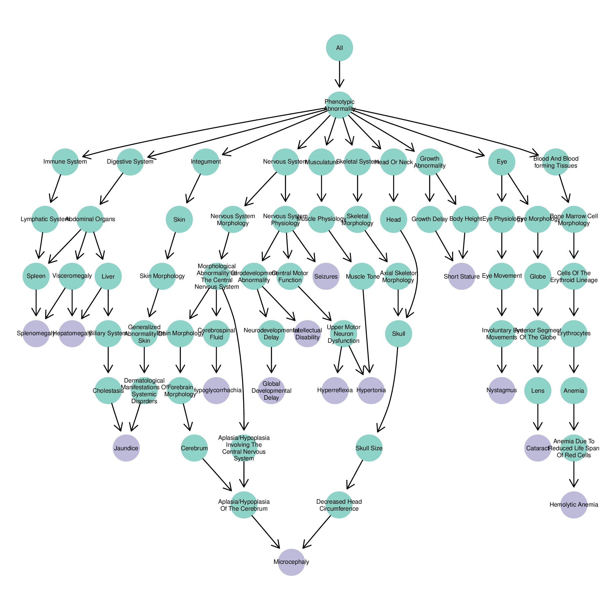
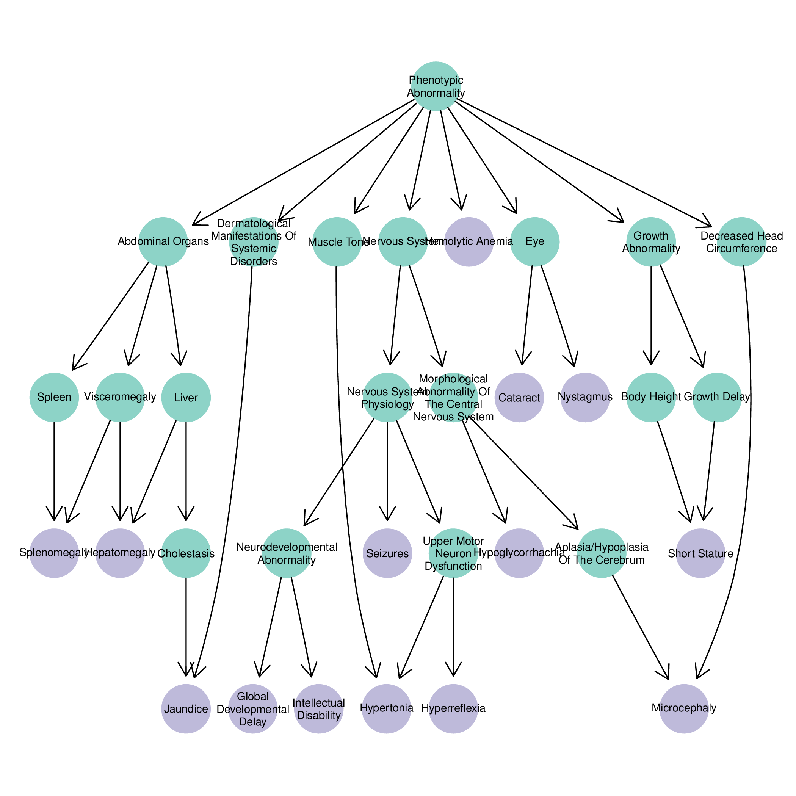

## Genes to phenotype and vice versa

The HPO team have provided two files that associate genes to HPO phenotypes and HPO phenotypes to genes.

```bash
# 925K
gunzip -c ../data/ALL_SOURCES_ALL_FREQUENCIES_genes_to_phenotype.txt.gz | head -5
#Format: entrez-gene-id<tab>entrez-gene-symbol<tab>HPO-Term-Name<tab>HPO-Term-ID
8192    CLPP    Seizures        HP:0001250
8192    CLPP    Short stature   HP:0004322
8192    CLPP    Primary amenorrhea      HP:0000786
8192    CLPP    Autosomal recessive inheritance HP:0000007

# 2.6M
gunzip -c ../data/ALL_SOURCES_ALL_FREQUENCIES_phenotype_to_genes.txt.gz | head -5
#Format: HPO-ID<tab>HPO-Name<tab>Gene-ID<tab>Gene-Name
HP:0001459      1-3 toe syndactyly      2737    GLI3
HP:0006088      1-5 finger complete cutaneous syndactyly        64327   LMBR1
HP:0010708      1-5 finger syndactyly   6469    SHH
HP:0010708      1-5 finger syndactyly   64327   LMBR1
```

The files are [not symmetrical](http://human-phenotype-ontology.github.io/faq.html) because the genes to phenotype file only lists the HPO term on the bottom of the ontology tree, i.e. and not all the ancestors.

```bash
gunzip -c ../data/ALL_SOURCES_ALL_FREQUENCIES_genes_to_phenotype.txt.gz | grep HP:0001459
2737    GLI3    1-3 toe syndactyly      HP:0001459

gunzip -c ../data/ALL_SOURCES_ALL_FREQUENCIES_phenotype_to_genes.txt.gz | grep HP:0001459
HP:0001459      1-3 toe syndactyly      2737    GLI3

# find the most frequent HPO terms
gunzip -c ../data/ALL_SOURCES_ALL_FREQUENCIES_genes_to_phenotype.txt.gz | cut -f4 | sort | uniq -c | sort -k1rn | head -5
1935 HP:0000007
1233 HP:0000006
 948 HP:0001249
 914 HP:0001250
 869 HP:0001263

gunzip -c ../data/ALL_SOURCES_ALL_FREQUENCIES_phenotype_to_genes.txt.gz | cut -f1 | sort | uniq -c | sort -k1rn | head -5
2422 HP:0000707
2217 HP:0012638
1957 HP:0000152
1935 HP:0000007
1934 HP:0000234

gunzip -c ../data/ALL_SOURCES_ALL_FREQUENCIES_genes_to_phenotype.txt.gz | grep HP:0000707 | wc -l
13

gunzip -c ../data/ALL_SOURCES_ALL_FREQUENCIES_phenotype_to_genes.txt.gz | grep HP:0000707 | wc -l
2422
```

How many genes are associated to phenotypes?

```bash
gunzip -c ../data/ALL_SOURCES_ALL_FREQUENCIES_phenotype_to_genes.txt.gz | grep -v "^#" | cut -f4 | sort -u | wc -l
3407

gunzip -c ../data/ALL_SOURCES_ALL_FREQUENCIES_genes_to_phenotype.txt.gz | grep -v "^#" | cut -f1 | sort -u | wc -l
3407
```

How many phenotypes are associated to genes on average?

```bash
# most genes associated to around 20 phenotypes
gunzip -c ../data/ALL_SOURCES_ALL_FREQUENCIES_genes_to_phenotype.txt.gz |
grep -v "^#" | cut -f1 | sort | uniq -c | awk '{print $1}' | stats
Total lines:            3407
Sum of lines:           105430
Ari. Mean:              30.9451130026416
Geo. Mean:              18.2808871643957
Median:                 20
Mode:                   2 (N=150)
Anti-Mode:              86 (N=1)
Minimum:                1
Maximum:                378
Variance:               1083.70787676299
StdDev:                 32.9197186616622

gunzip -c ../data/ALL_SOURCES_ALL_FREQUENCIES_genes_to_phenotype.txt.gz |
grep -v "^#" | cut -f2 | sort | uniq -c | sort -k1rn | head
    378 LMNA
    292 FGFR2
    267 FLNA
    265 FGFR3
    249 PTEN
    239 COL2A1
    226 ELN
    222 FGFR1
    207 CHD7
    202 BRAF
```

## Genes to OMIM

The `gene_to_omim.pl` script can look up OMIM disorders from a gene symbol.

```bash
gene_to_omim.pl FGFR2
FGFR2   614592
FGFR2   613659
FGFR2   609579
FGFR2   207410
FGFR2   149730
FGFR2   123790
FGFR2   123500
FGFR2   123150
FGFR2   101600
FGFR2   101400
FGFR2   101200
There were 11 matches for FGFR2
```

## Example usage

I may be interested in the HPO terms associated with the gene [SLC2A1](https://ghr.nlm.nih.gov/gene/SLC2A1), which encodes GLUT1 (a protein that helps transport glucose into cells from blood) because I found a deleterious mutation in this gene in a patient. Are there any OMIM disorders associated with this gene?

```bash
gene_to_omim.pl SLC2A1
SLC2A1  608885
There were 1 matches for SLC2A1
```

SLC2A1 is associated with [STOMATIN-DEFICIENT CRYOHYDROCYTOSIS WITH NEUROLOGIC DEFECTS](https://www.omim.org/entry/608885). What are the HPO terms associated with this gene? Do they match phenotypes in the patient?

```bash
gene_to_hpo.pl SLC2A1
6513    SLC2A1  Hepatomegaly    HP:0002240
6513    SLC2A1  Intellectual disability HP:0001249
6513    SLC2A1  Seizures        HP:0001250
6513    SLC2A1  Short stature   HP:0004322
6513    SLC2A1  Hyperreflexia   HP:0001347
6513    SLC2A1  Hypoglycorrhachia       HP:0011972
6513    SLC2A1  Cataract        HP:0000518
6513    SLC2A1  Global developmental delay      HP:0001263
6513    SLC2A1  Splenomegaly    HP:0001744
6513    SLC2A1  Hemolytic anemia        HP:0001878
6513    SLC2A1  Jaundice        HP:0000952
6513    SLC2A1  Microcephaly    HP:0000252
6513    SLC2A1  Hypertonia      HP:0001276
6513    SLC2A1  Nystagmus       HP:0000639
There were 14 matches for SLC2A1
```

Visualise the HPO terms.

```bash
../prop/plot_hpo.R HP:0002240 HP:0001249 HP:0001250 HP:0004322 HP:0001347 HP:0011972 HP:0000518 HP:0001263 HP:0001744 HP:0001878 HP:0000952 HP:0000252 HP:0001276 HP:0000639
convert -density 300 -quality 100 hpo.pdf hpo.png
mv hpo-0.png image/SLC2A1_full.png
mv hpo-1.png image/SLC2A1_condensed.png
rm hpo.pdf
```




The script `gene_to_hpo_full.pl` returns all HPO terms associated with a gene, including parent terms, unlike `gene_to_hpo.pl` which only returns the terminal term.

```bash
gene_to_hpo_full.pl SLC2A1

...
There were 71 matches for SLC2A1
```

## Semantically similar genes

I have created a matrix of Jaccard indices between all the genes based on their associated HPO terms.

```bash
# which generates the R object
# my_jaccard_matrix_gene_all.Robj
jaccard_all.R
```

We can use this matrix to find semantically similar genes.

```R
load("my_jaccard_matrix_gene_all.Robj")

my_jaccard_matrix[upper.tri(my_jaccard_matrix, diag = TRUE)] <- 0

# similarity on average
summary(my_jaccard_matrix[lower.tri(my_jaccard_matrix)])
   Min. 1st Qu.  Median    Mean 3rd Qu.    Max. 
0.00000 0.02186 0.05618 0.07310 0.10700 1.00000

table(my_jaccard_matrix > 0.99)

   FALSE     TRUE 
11606901      748 

head(which(my_jaccard_matrix > 0.99, arr.ind = TRUE, useNames = FALSE))
     [,1] [,2]
[1,]    8    7
[2,]   15    7
[3,]   15    8
[4,]   28   26
[5,]   84   80
[6,]   87   80

my_mat <- which(my_jaccard_matrix > 0.99, arr.ind = TRUE, useNames = FALSE)
dim(my_mat)
[1] 748   2

df <- data.frame(x = row.names(my_jaccard_matrix)[my_mat[,1]], y = colnames(my_jaccard_matrix)[my_mat[,2]])
head(df, 20)
         x          y
1    GABRD     KCNAB2
2     RERE     KCNAB2
3     RERE      GABRD
4     GPC3       GPC4
5    PRKG1        LOX
6     MYLK        LOX
7     MYLK      PRKG1
8     SPIB      MMEL1
9  POU2AF1      MMEL1
10 TNFSF15      MMEL1
11   TNPO3      MMEL1
12 POU2AF1       SPIB
13 TNFSF15       SPIB
14   TNPO3       SPIB
15 TNFSF15    POU2AF1
16   TNPO3    POU2AF1
17   SEC63     PRKCSH
18   TNPO3    TNFSF15
19     IPW SNORD115-1
20   PWRN1 SNORD115-1
```

If we look up line number 7, we will find that MYLK is associated with [AORTIC ANEURYSM, FAMILIAL THORACIC 7](https://www.omim.org/entry/613780) and PRKG1 is associated with [AORTIC ANEURYSM, FAMILIAL THORACIC 8](https://www.omim.org/entry/615436).

### Subset of genes

Obtaining the indices for a subset of genes: NRAS, RIT1, SOS1, RAF1, BRAF, KRAS, PTPN11, SOS2, LZTR1, NS2.

```r
my_gene <- c('NRAS', 'RIT1', 'SOS1', 'RAF1', 'BRAF', 'KRAS', 'PTPN11', 'SOS2', 'LZTR1', 'NS2')

# check if all genes exist
my_gene %in% colnames(my_jaccard_matrix)
 [1]  TRUE  TRUE  TRUE  TRUE  TRUE  TRUE  TRUE  TRUE  TRUE FALSE

my_gene <- my_gene[my_gene %in% colnames(my_jaccard_matrix)]

df <- data.frame(x = combn(my_gene, m=2)[1,],
                 y = combn(my_gene, m=2)[2,],
                 z = apply(combn(my_gene, m=2), 2, function(x) my_jaccard_matrix[x[1], x[2]]))

head(df)
     x      y         z
1 NRAS   RIT1 0.4139887
2 NRAS   SOS1 0.4200743
3 NRAS   RAF1 0.4123539
4 NRAS   BRAF 0.4337838
5 NRAS   KRAS 0.6109375
6 NRAS PTPN11 0.3897281

summary(df$z)
   Min. 1st Qu.  Median    Mean 3rd Qu.    Max. 
 0.3897  0.4201  0.5137  0.5556  0.6232  0.9565
```

This list of genes are all associated with [Noonan syndrome](https://www.omim.org/phenotypicSeries/PS163950) and from the summary, the median value of this subset is much higher than the median of all Jaccard indices.

